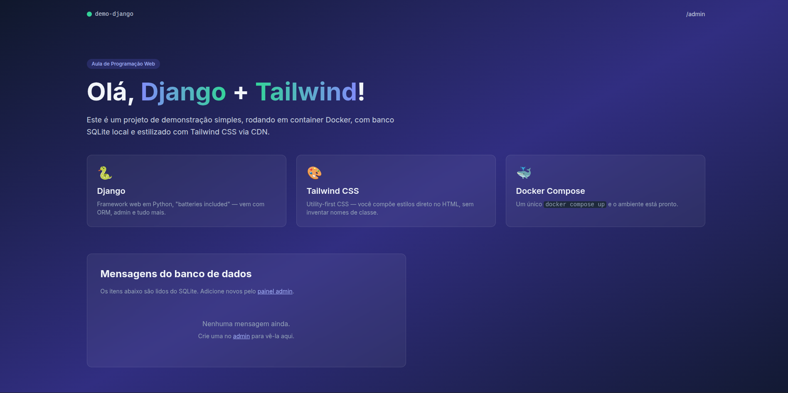

#Leonardo de Souza Gomes
---
Obs.: Cometi um erro ao desenvolver o roteiro 1 do Django, ao invés de criar uma branch nova apenas commitei.
Fiz o que pude para voltar o commit para o estado do roteiro 1 do Django

