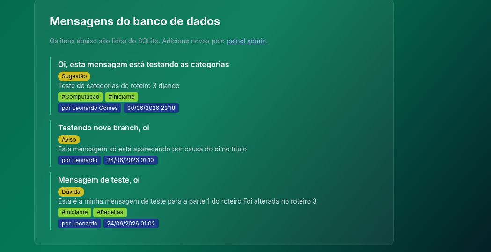
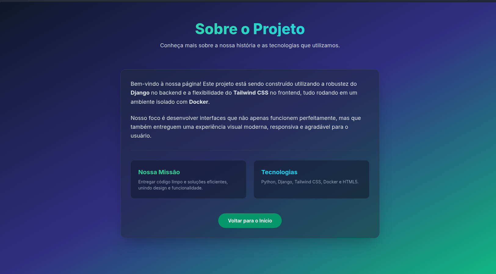
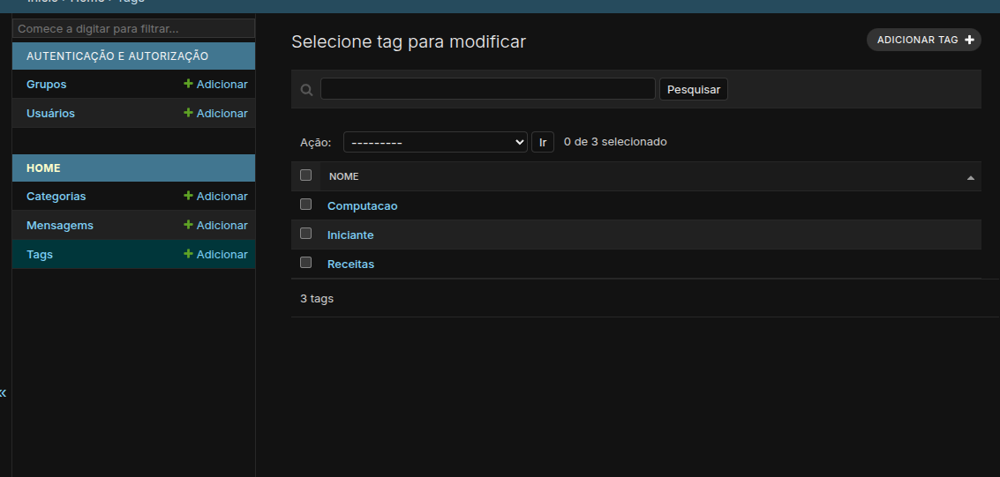

# Roteito 2 - Django

## Leonardo de Souza Gomes
```bash
# Criar imagens do container
docker compose build

# subir containers
docker compose up -d

# parar containers
docker compose down
#Atualizar banco de dados
docker compose run --rm web python manage.py makemigrations
docker compose run --rm web python manage.py migrate
#criar admin
docker compose exec web python manage.py createsuperuser

```
Para visualizar a página
http://localhost:8000

# Screenshots



